GroceryMandu - E-Commerce Website
Project Overview
GroceryMandu is a fully responsive and mobile-friendly e-commerce website designed for a shopping mart. This project allows users to browse and explore a variety of products conveniently across multiple devices. The website provides a seamless shopping experience with easy navigation, a clean design, and clear product organization.

Technologies Used
* HTML5 – Structure and content of web pages
* CSS3 – Styling, layouts, and responsiveness

Features
* Responsive Design: Works seamlessly on desktops, tablets, and mobile devices.
* Multi-Page Layout: Includes Home, Product, Research, and About pages.
* Product Browsing: Users can explore a wide range of items available in GroceryMandu.
* Research Page: Allows users to check information about products or categories.
* About Page: Provides details about GroceryMandu, its mission, and services.

Pages Overview
1. Home Page:
    * Landing page with an overview of available products and promotions.
    * Includes banners, featured items, and navigation links.
2. Product Page:
    * Displays all products in the mart with categories.
    * Allows easy selection and browsing of items.
3. Research Page:
    * Provides insights or details about products.
    * Can be used to find information about product availability or specifications.
4. Blog Page:
   * Read articles and updates about products, deals, or tips.
 5. About Page:
    * Information about GroceryMandu, its mission, and services.
    * Contact or general company information may also be included.

Installation & Usage
1. Clone or download the repository:
 git clone <repository-link>
 2. Open the project folder.
 3. Launch any HTML file (e.g., index.html) in a web browser to view the website.

Future Enhancements
* Add a shopping cart functionality.
* Implement search and filter options for products.
* Integrate backend for dynamic content and user authentication.
* Add payment gateway for online transactions.

Screenshots
### Home Page
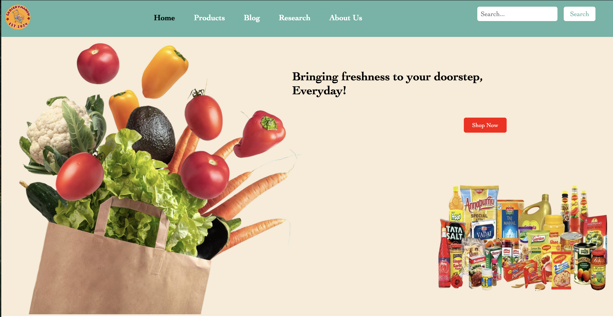
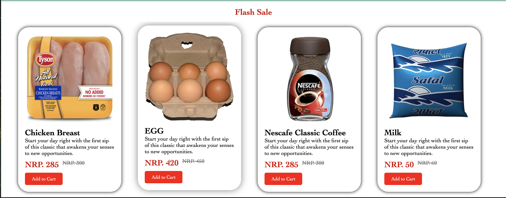
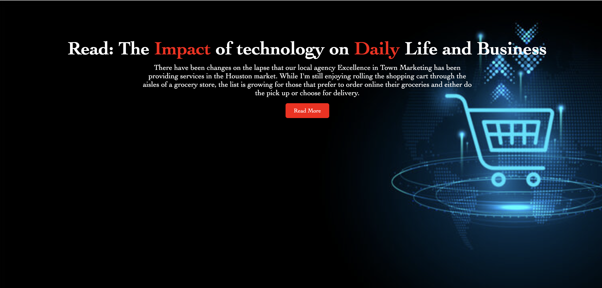
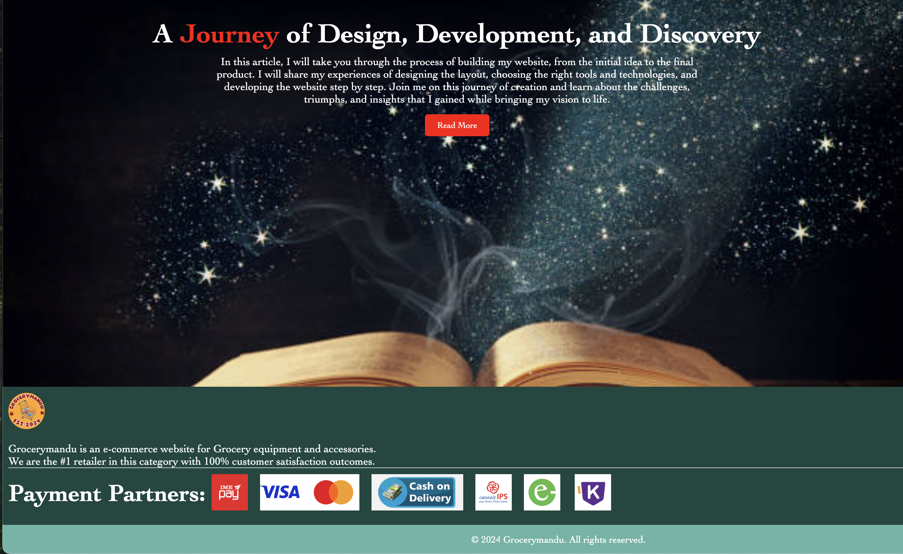

### Product Page
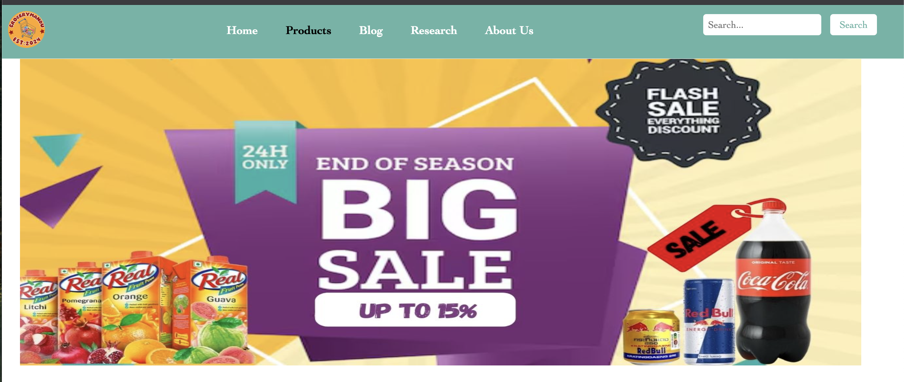
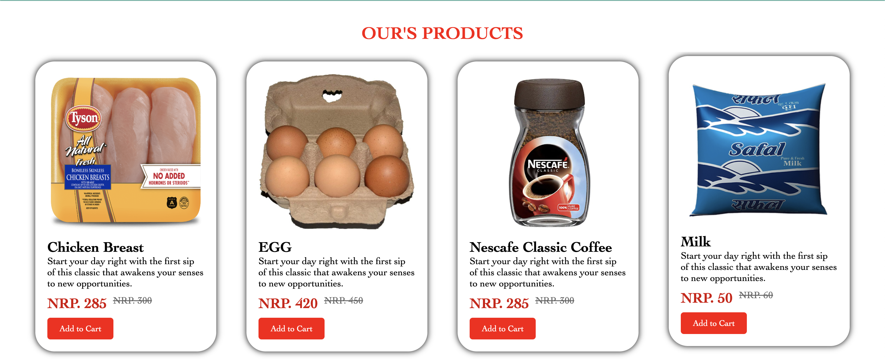
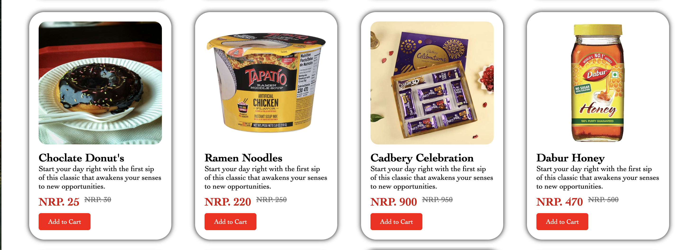
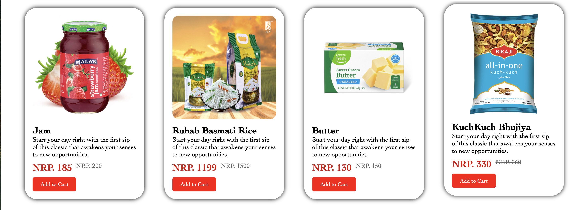
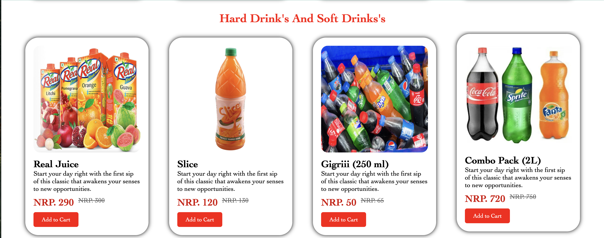
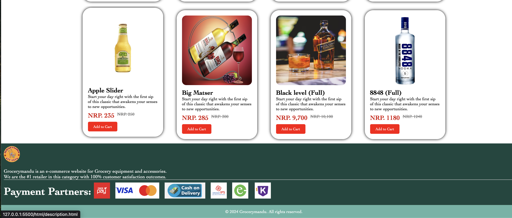

### Research Page
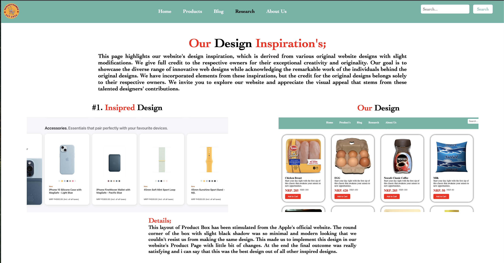
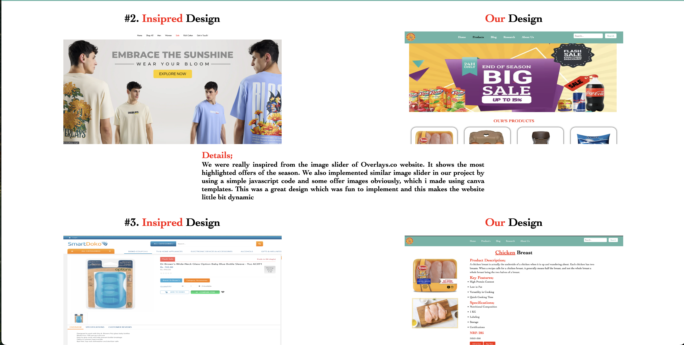
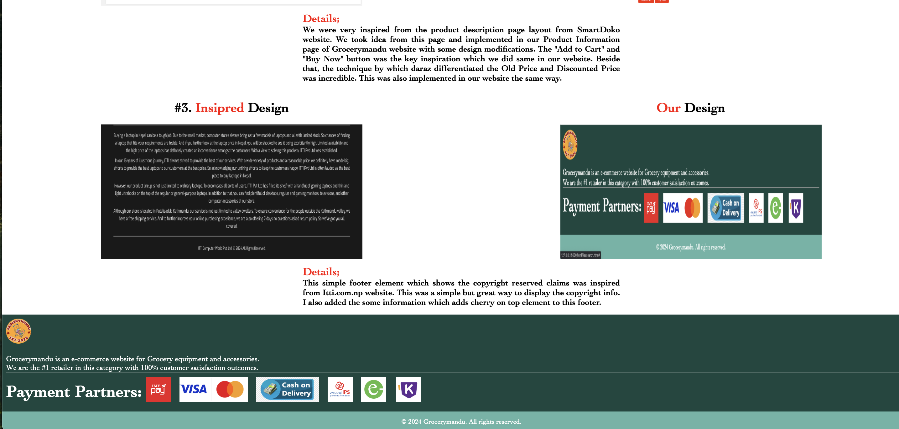

### Blog Page
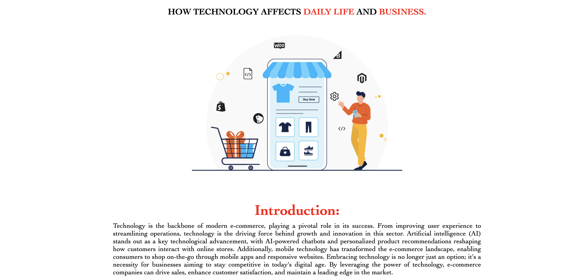
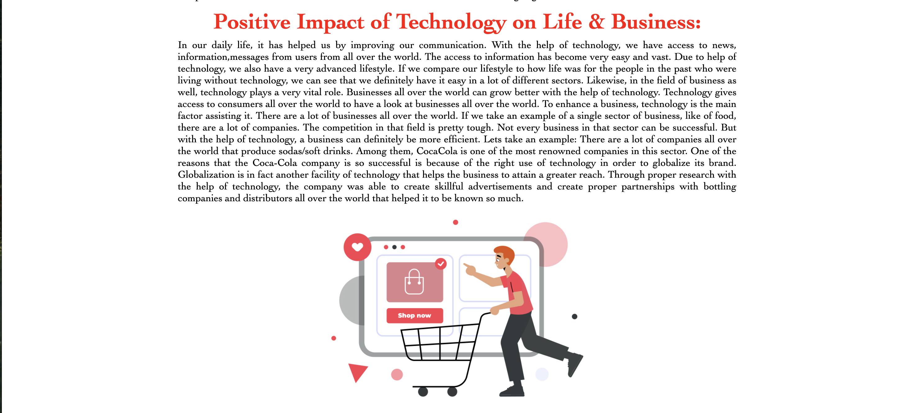
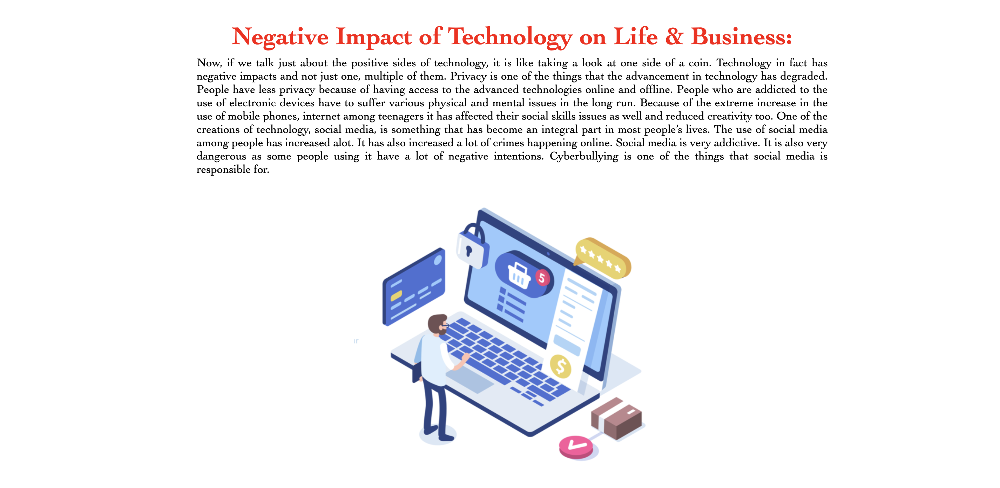
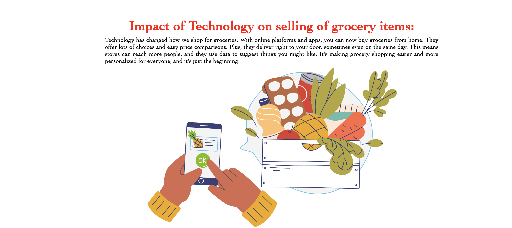
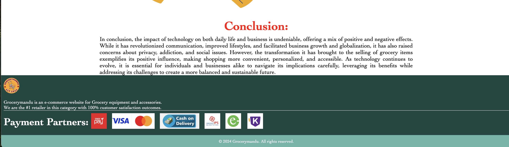

### About Page

Author
Ankit Bhandari
* Passionate about front-end development and building responsive web projects.
* Contact: ankeetbhandari77@gmail.com
